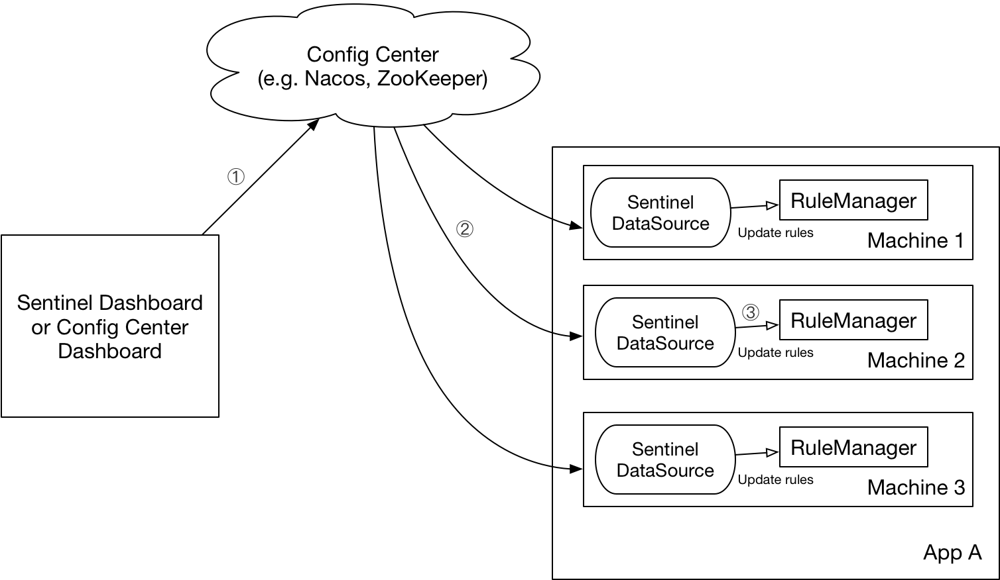

### 规则持久化控制台改造方式

此处使用的是推模式，使用到了一个数据源（此处使用的是Nacos配置中心数据源）

其工作原理图：



#### 简单的介绍推模式的原理

- Sentinel控制台（规则中心）：
  - 将更新的规则推送至Nacos或者其它远程配置中心（Nacos，ZK，Apollo，Redis）
  - 控制台查询配置中心配置的规则并更新到本地内存中
- Sentinel客户端：
  - 客户端实现 ReadableDataSource 监听并更新配置规则

#### 推模式与拉模式的比较

- 推模式：客户端通过监听的方式，时刻监听配置中心的变化 （例如基于Nacos的数据源）
  - 优点：保证了实时性
  - 缺点：依赖第三方的配置中心，增加开发难度
- 拉模式：客户端向规则中心定期拉取配置的规则（例如基于文件的数据源）
  - 优点：开发简单，无第三方的依赖
  - 缺点：实时性不高

#### 当前支持的持久化配置

- 流控规则
- 降级规则
- 热点规则
- 系统规则
- 授权规则

**实现的效果**


#### 持久化的思路

控制台持久化的主要工作内容是将规则的推送方式和读取方式从本地内存改为Nacos等配置中心

- 修改pom

  ```xml
  <!-- for Nacos rule publisher sample -->
  <dependency>
    <groupId>com.alibaba.csp</groupId>
    <artifactId>sentinel-datasource-nacos</artifactId>
    <!-- <scope>test</scope> 将此行注释掉 -->
  </dependency>
  ```

- 修改对应Controller流控规则获取方式（以流控规则为例）

  ```java
  @Autowired
  @Qualifier("flowRuleNacosProvider")
  private DynamicRuleProvider<List<FlowRuleEntity>> ruleProvider;
  @Autowired
  @Qualifier("flowRuleNacosPublisher")
  private DynamicRulePublisher<List<FlowRuleEntity>> rulePublisher;
  ```

- 开发对应的Provider和Publisher

  参考样例：com/alibaba/csp/sentinel/dashboard/rule/nacos

#### 使用方式

```shell
cd sentinel-dashboard
mvn clean package -Dmaven.test.skip=true
java -jar sentinel-dashboard.jar
```

### 规则持久化客户端使用方式

- 导入依赖

```xml
<!-- sentinel 整合成功会暴露/actuator/sentinel端点 -->
<dependency>
    <groupId>com.alibaba.cloud</groupId>
    <artifactId>spring-cloud-starter-alibaba-sentinel</artifactId>
</dependency>
<!-- 整合sentinel持久化到nacos -->
<dependency>
<groupId>com.alibaba.csp</groupId>
<artifactId>sentinel-datasource-nacos</artifactId>
</dependency>
```

- 修改配置


```yaml
spring:
  cloud:
    sentinel:
      transport:
        # 指定sentinel控制台的地址
        dashboard: localhost:8080
      datasource:
        flow:
          nacos:
            server-addr: localhost:8848
            dataId: ${spring.application.name}-flow-rules
            groupId: SENTINEL_GROUP
            # 规则类型，取值见：
            # org.springframework.cloud.alibaba.sentinel.datasource.RuleType
            rule-type: flow
        degrade:
          nacos:
            server-addr: localhost:8848
            dataId: ${spring.application.name}-degrade-rules
            groupId: SENTINEL_GROUP
            rule-type: degrade
        system:
          nacos:
            server-addr: localhost:8848
            dataId: ${spring.application.name}-system-rules
            groupId: SENTINEL_GROUP
            rule-type: system
        authority:
          nacos:
            server-addr: localhost:8848
            dataId: ${spring.application.name}-authority-rules
            groupId: SENTINEL_GROUP
            rule-type: authority
        param-flow:
          nacos:
            server-addr: localhost:8848
            dataId: ${spring.application.name}-param-flow-rules
            groupId: SENTINEL_GROUP
            rule-type: param-flow
      eager: true
```

### 监控数据持久化

目前持久化到InfluxDB数据库中，默认查询半个小时内的监控数据（mysql版见 feature/persistence_mysql）

#### 持久化的思路

- 新增依赖

  ```xml
  <!-- influxdb -->
  <dependency>
      <groupId>org.influxdb</groupId>
      <artifactId>influxdb-java</artifactId>
      <version>2.21</version>
  </dependency>
  ```

- 修改监控数据Controller查询的数据源

  ```java
  @Autowired
  @Qualifier("influxDBMetricsRepository")
  private MetricsRepository<MetricEntity> metricStore;
  ```

- 实现MetricsRepository接口进行增删改查开发

  ```java
  com.alibaba.csp.sentinel.dashboard.repository.metric.InfluxDBMetricsRepository
  ```

